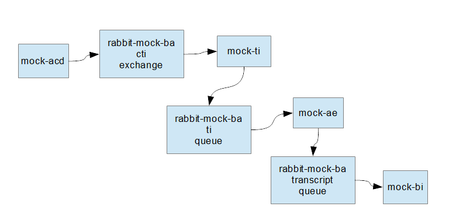

# mock-ba
Consists of the following components.

## mock-acd
Generates fake call event messages and publishes to a Rabbit exchange named _cti_.

## mock-ti
Subscribes to Rabbit exchange named _cti_, and receives the call event messages from mock-acd.
Publishes messages received from mock-acd to Rabbit queue named _ti_.

## mock-ae
Subscribes to Rabbit queue named _twitter_, and receives tweets from twitter.

Subscribes to Rabbit queue named _ti_, and receives the call event messages from mock-ti.
Generates a transcript from each message recieved from mock-ti.
Publishes transcript to Rabbit queue named _transcript_.

## mock-bi
Subscribes to Rabbit queue named _transcript_, and receives the transcripts from mock-ae.
Does nothing with the transcripts.

## rabbit-mock-ba
This is RabbitMQ.

## Deployment
Go to a root directory.
```
> cd c:/Users/matr00659/development/github/kubernetes
```

Pull all the source repositories from github.
```
git clone https://
```

### Diagram


Reference-style:
![alt text][diagram]

[diagram]: images/diagram.png "Diagram"

## Installation
Install this on a kubernetes cluster.
First apply the files in mock-ba/_k8s
```
> kubectl apply -f namespace.yml
> kubectl -n mock-ba apply -f role.yml
> kubectl -n mock-ba apply -f serviceaccount.yml
> kubectl -n mock-ba apply -f clusterorlebinding.yml
> kubectl -n mock-ba apply -f configmap.yml
> kubectl -n mock-ba apply -f secret.yml
```
Then install the mock ba components.
